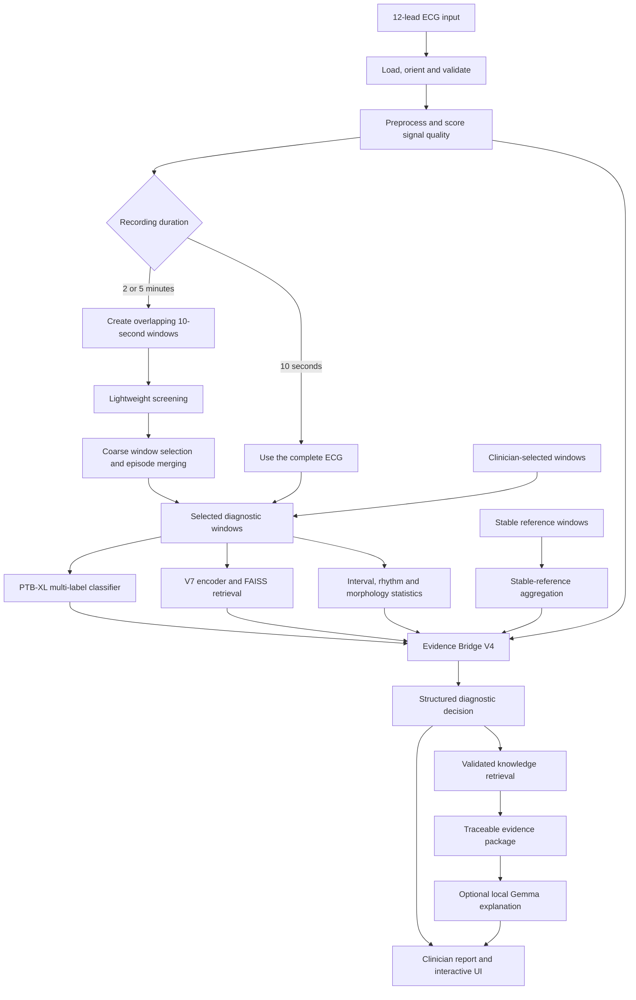

# ECG CDSS

ECG CDSS is an offline-first, clinician-facing ECG decision-support runtime for canonical 12-lead recordings. It combines signal validation, window screening, a PTB-XL multi-label classifier, V7 embedding retrieval, ECG measurements, validated clinical knowledge and a deterministic evidence-fusion layer. An optional local Gemma model can explain the result, but it cannot change it.

This repository is the inference/deployment bundle. It does not expose model training, threshold calibration, FAISS index construction or model promotion.

> **Clinical safety:** ECG CDSS is decision-support software, not an autonomous diagnostic device. Its outputs require clinician review and must not be used alone to make treatment or procedural decisions.

## What the system produces

For each ECG, ECG CDSS returns:

- signal-quality and acquisition checks;
- recording-level rhythm and morphology measurements;
- selected diagnostic windows with timestamps;
- multi-label PTB-XL probabilities and family predictions;
- similar ECG examples from the frozen V7/FAISS index;
- a deterministic Bridge V4 decision with confidence, limitations and evidence;
- validated knowledge citations; and
- optionally, a local-LLM explanation grounded in the immutable decision.

## Architecture at a glance



The central design rule is that **Evidence Bridge V4 owns the machine decision**. Retrieval, optional Holter localization and Gemma provide supporting context; none of them can independently override the Bridge result.

## Component guide

### 1. ECG loading and input contract

`ecg_loader.py` loads `.npy`, `.npz`, `.csv`, `.txt` and optional WFDB `.hea/.dat` recordings. It orients the array to `[12, samples]`, verifies the lead count, validates duration and sampling rate, and assigns one of three supported modes: `10s`, `2min` or `5min`.

The canonical lead order is `I II III aVR aVL aVF V1 V2 V3 V4 V5 V6`. If the source uses another order, pass all 12 names with `--lead-names`.

### 2. Preprocessing and signal quality

`preprocessing/ecg_preprocessor.py` and `preprocessing/signal_quality.py` perform the validated cleaning and quality checks used by downstream branches. The quality result follows the ECG throughout the pipeline. Unusable windows are excluded, and poor overall quality can lower confidence or force a fail-closed decision instead of allowing weak evidence to appear certain.

### 3. Long-recording window screening

Ten-second inputs are analyzed directly. For 2- and 5-minute recordings, `backend/recording_analysis.py` and `long_recording_v2/inference.py` create overlapping 10-second windows and screen every window using inexpensive signals:

- signal-quality score;
- frozen V7 embedding change;
- rhythm-change detection;
- fast rhythm and morphology statistics; and
- optional experimental Holter localization.

The coarse selector compares windows with neighbors and a stable recording baseline, merges adjacent detections into episodes, and refines episode boundaries. This limits the expensive diagnostic pipeline to relevant windows without losing clinician-selected windows. The optional Holter branch may help localize events, but it never has diagnostic authority.

### 4. PTB-XL multi-label classifier

`backend/inference_pipeline.py` loads the selected checkpoint and thresholds from `ptbxl_five_superclass/assets/`. It produces calibrated probabilities for the locked SCP labels plus five diagnostic superclasses. It is multi-label: several findings can be supported in the same ECG rather than forcing a single class.

### 5. V7 encoder and FAISS retrieval

The frozen V7 encoder maps a diagnostic window into the representation expected by the production FAISS index under `faiss/v7/`. Retrieval returns similar indexed ECGs and metadata. These neighbors are examples and supporting context—not proof that the current patient has the same diagnosis.

### 6. ECG statistics

`backend/bridge/ecg_statistics.py` derives interpretable measurements such as heart rate, RR variability, QRS-related measurements, rhythm flags and morphology statistics. Whole-recording statistics provide context while interval statistics describe selected windows. Statistics form an independent evidence branch instead of being generated by the classifier or LLM.

### 7. Stable-reference aggregation

For long recordings, stable windows provide an internal baseline. The system compares selected episodes with the patient's surrounding recording, helping distinguish persistent baseline morphology from transient changes.

### 8. Evidence Bridge V4

`backend/bridge/evidence_bridge_v4.py` is the authoritative deterministic fusion layer. It normalizes classifier, retrieval, statistics, signal quality, selected windows and optional localization evidence; evaluates candidate labels; resolves normal versus abnormal evidence; assigns status and confidence; and records limitations and time intervals.

The Bridge returns a structured, validated object. It fails closed when required evidence is malformed or insufficient. Its result is preserved as the source of truth for the API, report, feedback snapshot and LLM prompt.

### 9. Validated knowledge and citations

`utils/knowledge_retriever.py` queries the validated knowledge assets under `knowledge/`. It verifies embedding invariants, maps labels to clinical concepts, filters citations through the source registry and returns compact evidence with source identifiers, section information, document links and hashes where available.

### 10. Optional local Gemma explanation

`utils/llm.py` and `prompt_builder/system_runtime.py` run the optional local Gemma GGUF through CUDA-enabled `llama-cpp-python`. Gemma receives the structured Bridge decision and retrieved evidence and may answer clinician questions in natural language. It cannot write data, call external services, alter model outputs or replace the Bridge decision.

The GGUF is distributed separately because its approximately 2.5 GB size exceeds GitHub's 2 GiB per-object LFS limit. Place it at:

```text
gemma-3-4b-it-GGUF/gemma-3-4b-it-Q4_K_M.gguf
```

Without this file, use the default `--llm disabled` mode. Classification, retrieval, statistics, Bridge fusion, knowledge evidence and the clinician UI continue to operate.

### 11. API, interfaces and feedback

- `api/main.py` exposes health, configuration, inference, recording, waveform, chat and clinician-feedback endpoints through FastAPI.
- `ui/streamlit_app.py` provides the lightweight deployment interface.
- `ui/Animated ECG Waveform Background/` contains the richer React/Vite clinician workspace.
- `backend/feedback/` and `clinician_feedback_system.py` store optional immutable response snapshots and append-only clinician corrections. Feedback never changes the active decision, thresholds or FAISS index during inference.

### 12. Runtime orchestration

`runtime/jetson_runtime.py` loads reusable components once, isolates recording and chat state, coordinates short and long recordings, generates deterministic fallback explanations when the LLM is disabled, and writes optional snapshots. `run_pipeline.py` is the supported command-line entry point.

## End-to-end walkthrough

### Walkthrough A: verify and analyze the included 10-second ECG

1. Create and activate a Python 3.10 environment on the target machine.
2. Install the JetPack-compatible PyTorch wheel first on Jetson.
3. Install the runtime requirements:

   ```bash
   python3 -m pip install -r requirements/jetson-runtime.txt
   ```

4. Confirm that all non-LLM deployment assets are present:

   ```bash
   python3 run_pipeline.py --check-assets --llm disabled
   ```

5. Analyze the included sample:

   ```bash
   python3 run_pipeline.py \
     --ecg sample_data/deployment_test_ecg_378.npy \
     --sampling-rate 100 \
     --mode 10s \
     --llm disabled \
     --output outputs/sample_result.json
   ```

6. Open `outputs/sample_result.json`. Review acquisition and quality first, then classifier probabilities, retrieval evidence, statistics and finally `final_diagnostic_decision`. The decision status, confidence, supporting windows and limitations should be interpreted together.

### Walkthrough B: analyze a 2- or 5-minute recording

```bash
python3 run_pipeline.py \
  --ecg recordings/case_001.npy \
  --sampling-rate 100 \
  --mode 5min \
  --manual-windows 3 8 17 \
  --llm disabled \
  --output outputs/case_001.json
```

The runtime creates overlapping windows, screens the complete recording, keeps automatically detected episodes and adds clinician-selected indices `3`, `8` and `17`. Only selected windows enter the detailed classifier/retrieval pipeline; whole-recording and stable-reference evidence still contribute context.

### Walkthrough C: enable the local Gemma assistant on Jetson

Build a CUDA-enabled llama.cpp binding:

```bash
export CUDACXX=/usr/local/cuda/bin/nvcc
export CMAKE_ARGS="-DGGML_CUDA=on"
export FORCE_CMAKE=1
python3 -m pip install --no-cache-dir --force-reinstall \
  "llama-cpp-python>=0.3.34,<0.4"
```

Place the GGUF at the configured path, then verify it:

```bash
python3 run_pipeline.py --check-assets --llm real
```

Run a case with an evidence-grounded question:

```bash
python3 run_pipeline.py \
  --ecg recordings/case_001.npy \
  --sampling-rate 100 \
  --mode 5min \
  --llm real \
  --question "What abnormalities occurred, when, and what evidence supports them?" \
  --output outputs/case_001_with_explanation.json
```

For repeated questions without reloading the case and model, add `--chat`. At the `Clinician>` prompt, use `/decision` to display the immutable Bridge decision and `/exit` to finish.

### Walkthrough D: run the API and clinician UI

Start the API from the repository root:

```bash
python3 -m uvicorn api.main:app --host 0.0.0.0 --port 8000
```

On CPU-only development systems, the API disables only the advisory LLM and keeps the ECG pipeline available. On a configured CUDA host, enable Gemma with `TRACE_LLM_MODE=real`.

For the Streamlit interface, open a second terminal:

```bash
streamlit run ui/streamlit_app.py \
  --server.address 0.0.0.0 \
  --server.port 8501
```

For the React interface:

```bash
cd "ui/Animated ECG Waveform Background"
pnpm install --frozen-lockfile
pnpm run dev
```

In the interface, follow this review order:

1. confirm API health, device and LLM mode;
2. upload an ECG and confirm sampling rate, mode and lead order;
3. inspect quality and the waveform before accepting downstream evidence;
4. review selected windows and recording-level measurements;
5. inspect the structured system-consensus decision;
6. compare classifier, retrieval, statistics and cited knowledge evidence;
7. ask the optional assistant only after reviewing the structured decision; and
8. submit clinician feedback as an audit record when correction is needed.

## Repository map

| Path | Responsibility |
|---|---|
| `run_pipeline.py` | Supported CLI and asset check |
| `runtime/` | Lifecycle, orchestration, conversation state and snapshots |
| `ecg_loader.py` | Input parsing, orientation and duration validation |
| `preprocessing/` | Signal preprocessing, validation and quality scoring |
| `long_recording_v2/` | Optional long-recording localization model |
| `ptbxl_five_superclass/` | Classifier architecture, labels and thresholds |
| `joint_model/` | Frozen V7 retrieval model implementation |
| `faiss/v7/` | Production retrieval checkpoint, index and metadata |
| `retrieval/` | Encoder and retrieval wrappers |
| `backend/` | Inference, recording analysis, Bridge and feedback services |
| `knowledge/` | Validated chunks, embeddings, ontology and provenance |
| `prompt_builder/` | Evidence-grounded Gemma prompt and system policy |
| `utils/llm.py` | Disabled and CUDA llama.cpp LLM backends |
| `api/` | FastAPI schemas and endpoints |
| `ui/` | Streamlit and React clinician interfaces |
| `sample_data/` | Deployment smoke-test ECG |
| `requirements/` | Jetson system and Python runtime requirements |
| `docs/` | Deployment specification and bundle inventory |

## Input contract

- Exactly 12 ECG leads.
- Accepted orientation: `[12, samples]` or `[samples, 12]`.
- The true sampling rate must be supplied when it is not encoded in the source.
- Duration must match `10s`, `2min` or `5min` within one second.
- Alternate lead order requires all names through `--lead-names`.
- Inputs must be handled according to applicable patient-data governance rules.

## Operational and safety guarantees

- Bridge V4 remains the machine-decision authority.
- Gemma is advisory and cannot modify the Bridge output.
- LoRA/PEFT execution is retired from the selected deployment.
- Experimental Holter output can localize windows only.
- Retrieved ECGs are examples, not diagnostic proof.
- Poor or malformed evidence fails closed instead of silently fabricating support.
- Feedback is append-only and cannot update a live decision or model.
- The runtime is offline-first and does not require an external LLM API.
- Clinician review is mandatory.

See `docs/FINAL_VERSION_OPTIMIZED_SPEC.md`, `backend/bridge/BRIDGE_V4_CONTRACT.md` and `PRIVATE_REPOSITORY_ASSETS.md` for the locked deployment and asset policies.
